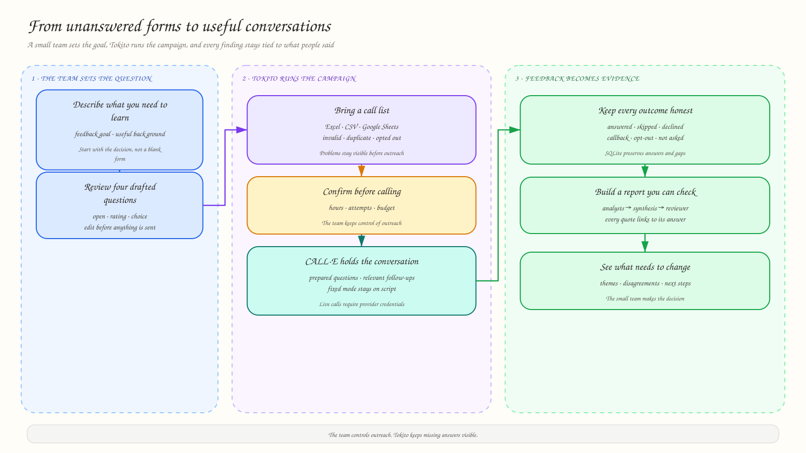

<p align="center">
  
</p>

<h1 align="center">Tokito</h1>

<p align="center"><strong>Google Forms, but people answer over a phone call.</strong></p>

<p align="center">Tokito helps organizers turn a feedback goal and contact list into guided conversations, traceable findings, and evidence-backed next steps.</p>

<!-- README-HACK:NEEDS-OWNER key="demo-video" instruction="Add the final public two-minute demo video URL here." -->
<!-- README-HACK:NEEDS-OWNER key="live-demo" instruction="Add the public Tokito deployment URL here." -->

<p align="center"><a href="https://github.com/vimzh/tokito">GitHub repository</a></p>

## Why Tokito

Forms are easy to send and easy to ignore. Society organizers still end up chasing members one by one, helping people through unclear questions, and manually combining partial answers into something useful.

Tokito turns that follow-up work into a campaign. The organizer explains what they need to learn, reviews the questions, imports the people to contact, and keeps control over when outreach starts. Respondents can answer naturally, ask for clarification, decline a question, request a callback, or opt out. Tokito keeps those outcomes visible instead of filling the gaps with guesses.

## What Tokito does

1. **Starts from the goal.** The organizer describes the decision or feedback they need, then reviews and edits four AI-drafted open, rating, or choice questions.
2. **Checks the contact list.** Tokito imports Excel or CSV files with `name` and `phone` columns, normalizes phone numbers, and surfaces invalid, duplicate, excluded, and opted-out rows before outreach.
3. **Runs the conversation.** A built-in text simulator provides a credential-free demo path. With CALL-E configured, the scheduler can place calls within campaign limits, retry missed calls, and ingest transcripts and structured answers.
4. **Preserves what happened.** Answer states such as skipped, declined, unknown, and not asked remain explicit. Callback requests and opt-outs flow into the campaign state.
5. **Builds a report that can be checked.** Per-question analyst agents feed a synthesis agent, then a reviewer removes unsupported findings. Quotes link back to the stored call and answer.
6. **Works across the team’s tools.** The web dashboard and Discord bot use the same API. Google Sheets can supply contacts and receive results, Google Calendar can track callbacks, and Notion can receive a published report.

<p align="center">
  
</p>

## Built for evidence, not polished guesses

Tokito separates deterministic facts from generated interpretation. Participation counts and answer status totals come from SQLite. Report agents receive evidence identifiers, generated citations are resolved in code, and unsupported items can be removed before the report is stored.

The current suite passes **75 tests** across the API and Discord bot. It covers contact validation, idempotent webhooks, retry limits, opt-outs, callbacks, exports, report citations, integration failures, Discord confirmations, and the shared API contract. Synthetic end-to-end evaluations also exercise dynamic follow-up questions, refusals, screening, callbacks, opt-outs, and questions that the evidence cannot answer.

## How it is built

Tokito is a Bun workspace with three applications:

- **Next.js 16 and React 19** provide the authenticated campaign dashboard.
- **Hono on Bun** owns campaigns, scheduling, integrations, reporting, and a local SQLite database accessed through Drizzle ORM.
- **discord.js and Strands Agents** provide slash commands and a conversational Discord agent, with confirmation buttons before state-changing actions.

The API builds a campaign-specific task and result schema for CALL-E. Terminal call events update transcripts and answers, then trigger connected-app work such as Sheets sync and Calendar callback updates. The dashboard and Discord bot read the same stored state. OpenAI models, orchestrated through Strands, handle question drafting, simulated conversations, report analysis, synthesis, review, and report Q&A.

<!-- README-HACK:GRAPH
type: architecture
brief: Show the Next.js dashboard and Discord bot calling one Hono API; the API using SQLite through Drizzle, OpenAI through Strands, and CALL-E for calls; CALL-E returning webhooks; and the API syncing Google Sheets, Google Calendar, and Notion. Distinguish tested local/fake-network paths from external services that still need a live credentialed run.
placement: after "How it is built"
-->

## What works today

The web, API, Discord command handling, text-call simulation, exports, report pipeline, CALL-E adapter, and Google/Notion integration paths are implemented. The external paths have automated coverage against fake providers and networks.

No live CALL-E call, Discord server session, Google account, or Notion account has been exercised in the recorded evaluation. The dashboard currently uses one shared demo login rather than per-organizer accounts. Tokito stores transcripts, not call audio, and region-specific consent requirements must be confirmed before real outreach.

## Built with

Bun, TypeScript, Next.js, React, Hono, SQLite, Drizzle ORM, Strands Agents SDK, OpenAI, CALL-E, Discord, Google Sheets, Google Calendar, and Notion.

## Run locally

Requires [Bun](https://bun.com/docs/installation).

```bash
bun run setup
bun run dev
```

Open the web app at <http://localhost:3000>. The API runs at <http://localhost:3002>.

`bun run setup` installs dependencies, creates local environment files, applies SQLite migrations, and seeds three draft campaigns. AI drafting and the external services require their corresponding credentials, but the core campaign UI and seeded data can run locally without them.

Run the automated checks with:

```bash
bun run lint
bun run typecheck
bun run build
cd apps/api && bun test
cd ../discord && bun test
```

For the prepared demo campaign and text simulations:

```bash
cd apps/api
bun run db:demo
```

See the [two-minute demo script](docs/demo.md), [system and reliability brief](docs/brief.md), and [evaluation record](docs/evaluation.md) for the intended walkthrough and its verified boundaries.

## What's next

- Run a consenting live CALL-E campaign and verify the full webhook path against real calls.
- Exercise Discord, Google Sheets, Calendar, and Notion with real accounts and record the results.
- Replace the shared demo login with per-organizer accounts and workspaces.
- Test whether phone conversations improve useful response collection for the society use case instead of assuming they outperform forms.
- Confirm regional consent, calling, retention, and data-handling requirements before broader outreach.
